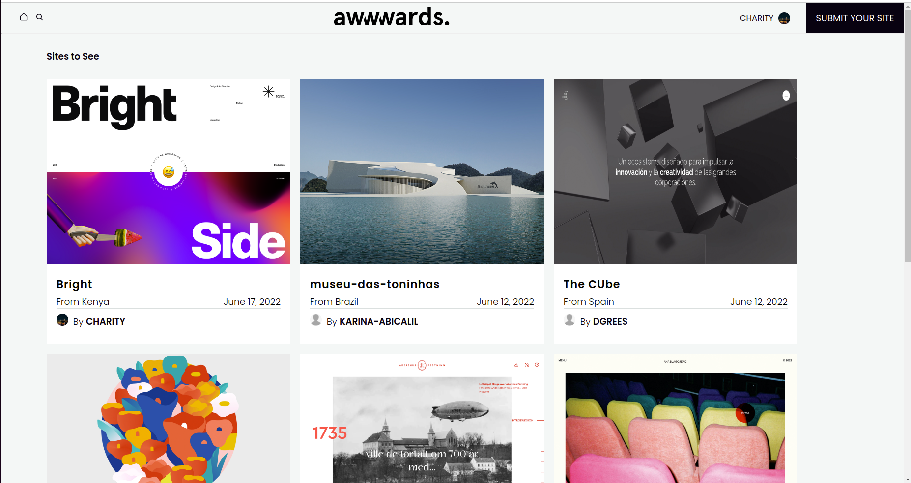

# awwards



<br>

A website appplication built using python <a href='https://docs.djangoproject.com/en/4.0/'>(Django)</a> that allows  users to
<a href='https://aww-ards.herokuapp.com/'>Live site</a> 

<ol>
<li> Post Projects</li>
<li> View Projects posted by other people</li>
<li> Update their Profile</li>
<li> Rate the projects by other users and have them appear in their profiles</li>
<li> View other people's profiles and the projects they have posted</li>
<ol>
<br>

## Table of Content
- [Prequisite](#prequisite)
- [Installation Requirement](#Installation)
- [Technology Used](#technology-used)
- [API Endpoints](#api-endpoints)
- [Licence](#licence)
- [Authors Info](#author-Info)


## Prequisite
- In order to be able to run the application you'll need to generate your cloudinary api key. Head over to <a href='https:/cloudinarycom/'>Cloudinary</a> and create an account.

<br>


## Installation

- You will need to clone the application and create a virtual and install the dependencies from requirements.txt.

<br>


```
$ git clone https://github.com/charity-bit/Awwards-Clone
$ python3 -m venv virtual 
$ pip install -r requirements.txt
$ pip list 
$ source virtual/bin/activate #to activate the virtual enviroment


```

<br>
create a .env file in the root folder to save your configuration variables that are neccessary in order for the application to run.

<br>

### inside your .env file

<br>

```
CD_NAME="cloud name app from cloudinary"
CD_API_KEY="api key from cloudinary"
CD_API_SECRET="api secret from cloudinary" 

SECRET_KEY='your secret key'
DEBUG=True
DB_NAME='your db name'
DB_USER='your db user'
DB_PASSWORD='password to the db user'
DB_HOST='127.0.0.1'
MODE='dev'
ALLOWED_HOSTS='127.0.0.1'
DISABLE_COLLECTSTATIC=1

```

- Assuming you already created the application database, You can now run the application.

## Run the application using 

```
$ make / $ make serve / python3 manage.py runserver
```
## Run tests

Run test to the models
```
$ make test / python3 manage.py tests
```


## Technology Used

<ul>
<li>
python Django
 </li>
<li>
PSQL 
</li>
<li>
Javascript
</li>
<li>
CSS
</li>
<li>
Ajax and Jquery
</li>
 <li>Django Rest Framework</li>
</ul>

<br>


## API Endpoints

<code> GET '/api/projects/'</code>
- get information about all projects
- supports POST requests

<br>

<code> GET '/api/profiles/'</code>

- get information about all profiles
- supports POST requests.


<code> GET '/api/profile/{profile_id}/'</code>

- get primary information about a single profile.

<code> GET '/api/project/{project_id}/'</code>

- get primary information about a single project.


## Licence

   copyright © Charity 2022 - <a href=""> MIT </a>

## Authors Info

-LinkedIn - [Charity Nyanchera](https://www.linkedin.com/in/charitynyanchera)

-twitter - [CcNyanchera](https://twitter.com/CcNyanchera)

